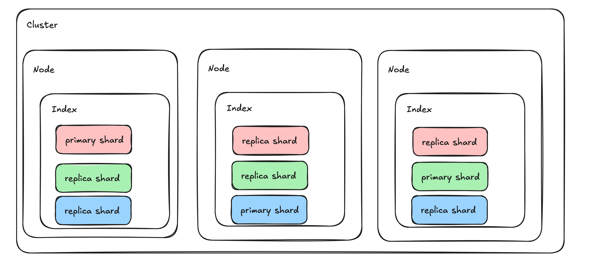
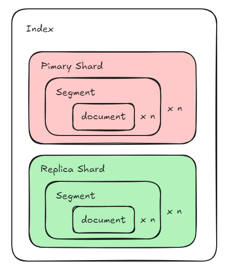
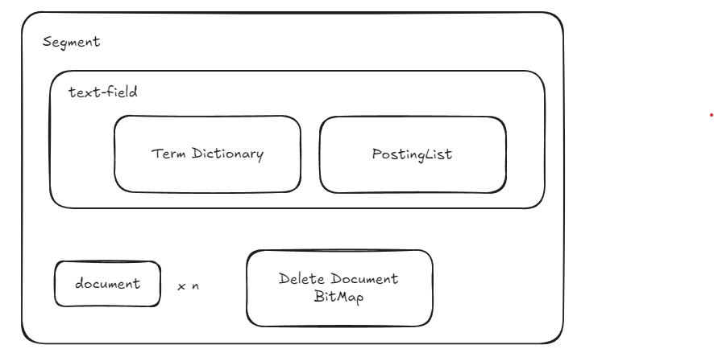
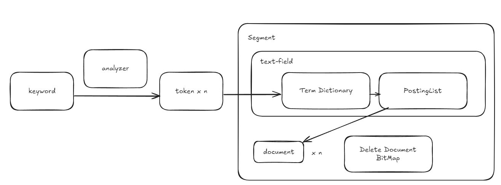

# 역사

# 아키텍처

- cluster
  - 다수 노드의 묶음
- node
  - 하나의 처리 서버
  - 코디네이팅 노드
    - 클러스터의 노드 중 클라이언트로 부터 요청을 받는 노드
- index
  - 동일 스키마를 가진 도큐먼트 모음
  - rdb의 테이블에 대응
- document
  - 스키마를 따라는 json 형태 데이터
  - rdb의 record에 대응
- field
  - document의 json에서 하나의 key
  - 다양한 타입의 value를 지원
  - rdb의 coloumn에 대응
- shard
  - 하나의 index를 분할해 놓은 객체
  - 인덱스를 만들 때 primary shard(원본) 과 replica shard(복사본) 숫자를 지정할 수 있습니다.
  - 위 그림은 동일 인덱스가 세개의 노드에 복사되어 저장되어 있는 상황에 대한 그림입니다. 원본 인덱스를 3등분 primary shard 로 나누었고 노드 수만큼 각 primary shard에 복사본을 줬습니다.

# 전문(text field) 검색 동작 방식
## 루씬 배경 지식
- 엘라스틱 서치는 루씬 기반이라 도큐먼트의 CRUD 동작을 이해하려면 루씬의 동작 방식을 알아야 합니다

- 루씬은 하나의 인덱스를 다수의 세그먼트로 관리합니다.(엘라스틱 서치는 인덱스를 샤드 단위로 나누어 관리하고 하나의 샤드는 다수 세그먼트로 구성되어 있습니다.) 하나의 세그먼트는 다수의 도큐먼트를 관리하고 있습니다.
- 하나의 세그먼트에는 인덱스의 필드별로 inverted index를 갖고 있고, delete document bitmap이 있습니다.
- inveted index는 Term Directory, Posting List로 이루어져 있습니다.
  - Term Directory
    - 세그먼트에 존재하는 도큐먼트들의 text field의 term들을 보관
    - FST(Finite State Transducer) 자료 구조
      - State 별로 term과 Posting List를 관리
      - 빠르게 특정 term이 있는 State를 찾을 수 있다
      - 효율적인 저장
      - term 을 접두사로 갖고 있는 term이 있는 State들을 찾을 수 있다
    - idf 를 계산할 수 있는 값을 갖고 있다
  - Posting List
    - term이 포함된 document id list
    - 각 document 별로 term 이 있는 위치를 갖고 있습니다.
    - 각 document 별로 tf 값을 갖고 있다
      - FreeqProxyPostingsArray 클래스 확인

- 검색된 문서들을 정렬하는 기준 score
  - tf(term, document), term frequency
    - term이 field에서 나온 횟수
    - 높을 수록 term이 field를 구분하는데 중요한 역할을 한다
  - df(term, document), document frequency
    - term이 존재하는 field를 가진 document 수
    - 높을 수록 term이 흔하게 등장해서 문서 구분에 중요하지 않다를 의미
  - idf(term, document), invert document frequency
    - log(문서 수 + 1)/((df + 1) + 1)
  - tf-idf(term, document)
    - tf(term, document) * idf(term, document)
    - 높을 수록 term이 document를 구분하는데 중요한 역할을 한다
    - 빈번하게 등장하는 걸 완화한다
  - bm25(keyword, document), best matching 25
    - tf-idf의 개선 버전, 엘라스틱 서치 기본 기준
    - keyword를 구성하는 term별로 tf, idf 를 계산해서 활용
    - 필드의 값이 길거나, 특정 term이 많이 반복될 때 좀 더 좋은 정규화식을 제공합니다

## 검색 처리 과정

본론인 검색어를 기반으로 도큐먼트를 어떻게 찾는지 알아 보겠습니다.
"검색"을 루씬 입장으로 해석하면 "index에서 keyword를 포함하는 text field를 가진 document들을 찾는 명령어" 입니다
1. analyzer에 의해 keyword가 token으로 분리됩니다
2. segment에서 token이 존재하는 document를 inverted index를 이용해 찾습니다.
3. 찾은 document들의 score를 계산합니다
루씬은 해당 과정을 스레드풀에서 사용 가능한 스레드들을 이용해 세그먼트에서 검색을 병렬로 처리합니다.
정리하자면 여러 자료 구조를 이용한 역인덱싱과 세그먼트 단위 병렬 처리가 루씬의 빠른 검색에 핵심입니다.

## 검색 성능 높이기
cpu 성능이 검색에 미치는 영향
 - 찾기, 점수 계산 등 cpu를 사용하는 연산을 빠르게 처리
 - 코어 수의 증가는 검색과 함께 다른 요청을 동시 처리할 수 있습니다
memory 크기가 검색에 미치는 영향
 - 더 많은 세그먼트를 메모리에 올려 디스크 IO를 줄여 검색 속도 증가
단순히 cpu나 memory를 늘리는 것보다 인덱스 스키마 설계, 샤딩, 쿼리 최적화, 클러스터링으로 검색 성능을 높일 수 있습니다.

# 도큐먼트 추가 동작 방식
1. 도큐먼트의 text field 를 analyzer가 token화
2. inverted index 생성
3. 메모리 버퍼에 도큐먼트를 저장
4. commit: 버퍼가 일정 크기가 되면 디스크에 세그먼트 형태로 저장
5. 디스크에 세그먼트 형태로 저장되어야 도큐먼트가 검색에 잡힙니다

# 도큐먼트 수정/삭제 동작 방식
루씬의 세그먼트는 immutable class 입니다
따라서 세그먼트안 도큐먼트의 field 값이 변경되면 새로 도큐먼트를 만들어야 합니다.

1. 변경된 값으로 새 도큐먼트 생성, 새 도큐먼트 추가 방식을 따릅니다.
2. 기존 도큐먼트가 있는 세그먼트의 delete document bit map에 삭제 표시, 삭제 표시된 도큐먼트는 검색에서 제외됩니다.
3. merge: 주기적으로 세그먼트들의 병합과 삭제 표시된 도큐먼트의 실제 삭제가 발생합니다. 세그먼트의 병합시 각 세그먼트의 inverted index의 병합이 발생합니다.

## 더그 커팅은 왜 ES의 도큐먼트를 immutable 객체로 설계 했을 까

검색엔진은 읽기 성능이 중요합니다.
읽기 쓰기가 섞인체로 오는 동시 요청들을 처리하기 위해 보통의 데이터 베이스는 락을 사용 합니다. 하지만 락을 사용하는건 시스템에 성능 저하를 가져 옵니다.
불변 객체를 이용하면 읽을 당시에 존재하는 객체에 대해 쓰기 상황을 고려하지 않아도 됩니다. 또한 불변 객체는 분산 환경에서 저장할 때 객체의 일관성 보장에 도움됩니다
동시 발생하는 쓰기에 대해서는 순서 처리를 위한 락만 존재하고 쓰기 작업을 수행할 때는 락을 사용하지 않아도 됩니다.

# 클러스터 동작 방식
## 검색
1. 코디네이팅 노드가 검색 대상의 인덱스의 샤드(primary든 replica든)를 가지고 있는 노드들을 클러스터링 정보로 부터 찾아 검색 요청을 전달합니다
2. 각 노드들은 가지고 있는 샤드들에 대해 병렬로 검색 처리를 합니다
3. 각 노드는 코디네이팅 노드로 결과를 보내고 코디네이팅 노드가 결과를 취합해 클라이언트에게 응답합니다

## 동기화
1. 코디네이팅 노드가 변경 작업을 받으면 해당 도큐먼트가 있는 프라이머리 샤드를 가진 노드에게 요청을 전달합니다
2. 노드는 변경 작업을 수행하고 레플리카 샤드를 가진 노드들에게 해당 작업을 수행하라 전달(이 과정은 엘라스틱 서치에서 개발한 프로토콜을 이용합니다)합니다
3. 프라이머리 샤드를 가진 노드가 레플리카 샤드를 가진 노드로 부터 처리 완료를 응답받으면 코디네이팅 노드에게 변경 작업 완료를 알립니다.
4. 코디네이팅 노드가 최종적으로 클라이언트에게 응답합니다

## 가용성: 프라이머리 샤드가 있는 노드가 다운되었을 떄 동작 방식
레플리카 샤드중 하나가 프라이머리 샤드로 승격합니다
변경 작업을 진행 중이다가 프라이머리 샤드가 있는 노드가 다운되면 해당 작업은 새로 승격된 프라이머리 샤드가 있는 노드에서 재 시작합니다

# reference
- 코드 출처, apache/lucene 2024.08.31 branch_9_8
- 루씬 프로젝트는 멀티 모듈로 되어 있고 라이브러리 의존성 추가 룰은 다음과 같다
  - org.apache.lucene:lucene-{모듈이름}:{버전}
  - 브랜치 이름 branch_9_8 의 코드 사용하고 싶은 경우 버전 9.8.0 을 지정
- 사용한 모듈
  - implementation 'org.apache.lucene:lucene-core:9.8.0'
  - implementation 'org.apache.lucene:lucene-queryparser:9.8.0'
  - implementation 'org.apache.lucene:lucene-codecs:9.8.0'
- 모든 그림 자체 제작 