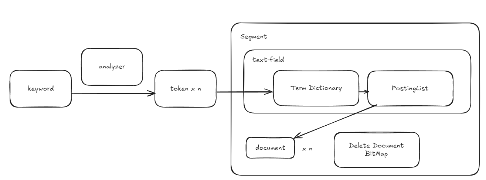

# score 계산
- TF(term, document, field)
  - Term Frequency
  - document에서 term이 field에 나온 횟수
  - 높을 수록 term이 document에서 중요한 의미를 갖는다
- DF(term, field)
  - Document Frequency
  - 전체 docuemnt 중 term이 field에 존재하는 document 수
  - 높을 수록 term이 흔하다. document를 구분하는데 중요하지 않다
- IDF(term, field)
  - log(전체 문서수 + 1)/(DF + 1)
  - 높을 수록 term이 흔하지 않다, document를 구분하는데 중요하다
- TF-IDF(term, document, field)
  - TF * IDF
- BM25(term, docuemnt, field)
  - TF, DF를 이용한 좀 더 정교한 계산식

# analyzer
- 한개의 토크나이저, 0개 이상의 전처리 필터로 구성, 0개 이상의 후처리 필터로 구성
- 토크나이저
  - 입력값을 정해진 규칙에 맞게 토큰들로 분할
- 필터
  - 입력값을 정해진 규첵이 맞게 변경
  - 전처리 필터는 토크나이저에 넣기 전 검색어를 처리하는 필터
  - 후처리 필터는 토크나이저 결과인 토큰을 처리하는 필터
