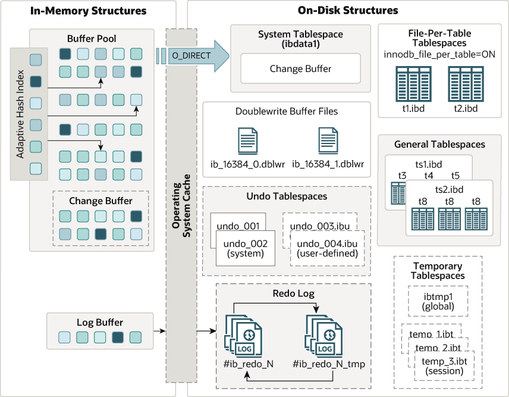

# InnoDB Arcchitecture 8.0

## Buffer Pool
- 디스크에서 읽은 데이터를 메모리에 캐싱하는 공간
- 읽기 처리
  - 읽기 쿼리 실행시 Buffer Pool에서 데이터 확인
    - hit 시 반환
    - miss 시 디스크 읽기 수행에 Buffer Pool에 적재
  - 개선된 LRU 캐시 정책 사용
    - deque 자료구조
    - head는 최근 페이지, tail은 접근한지 오래된 페이지
    - 사이즈가 꽊 차면 tail 페이지 지움
    - 새로 읽은 페이지는 head가 아니라 중간 지점에 삽입
      - 이유는 full scan 같은 단발성이면서 다수 페이지를 가져오는 쿼리를 처리할 때 실제 비즈니스에서 많이 사용하는 페이지를 tail쪽으로 미는걸 방지
- 쓰기 처리
  - 쓰기 작업할 페이지를 읽기 처리
  - Buffer Pool에 적재된 페이지에 쓰기 작업, 디스크에 페이지에는 Dirty Page로만 표시
  - flush 작업시 Buffer Pool 내용을 디스크에 반영

## Change Buffer
- secondary index 의 쓰기 작업을 디스크에 바로 반영하지 않고 메모리에 임시 기록하는 공간
- 백그라운드 스레드가 디스크에 반영한다

## Log Buffer
- 데이터 변경 기록 메모리 기록 공간

## Double Write Buffer Files
- 디스크의 Dirty Page에 Buffer Pool의 내용을 쓰기 전 기록하는 파일
- dblwr 확장자 파일
- Dirty Page를 통으로 기록
- 백그라운드 스레드가 dblwr 파일 내용을 ibd 파일로 덮어쓴다
- Dirty Page에 대응하는 Buffer Pool의 페이지가 LRU 정책으로 밀리기전 반드시 dblwr 파일 내용이 ibd 파일로 덮어쓰여진다

## Undo Tablespaces
- 데이터 변경시 변경 기록을 보관하는 파일
- Read View에서 사용하는 Undo Log Chain을 기록하는 파일
- 롤백시 해당 파일 데이터를 읽어 데이터 복구

## Redo Log
- 커밋시 데이터 변경 기록을 보관하는 파일
- 장애 발생시 디스크에 쓰이지 못한 커밋 내용을 해당 파일을 이용해 복구

## System Tablespace
- ibdata1 파일
- 컬럼의 데이터 타입, 제약조건 관리

## Database
- 데이터페이스 이름으로된 폴더

## File Per Table Tablespaces
- 테이블 이름으로된 파일
- ibd 확장자 파일
- 테이블의 데이터, 인덱스 데이터 기록된 파일

## Row, Page, Extent
- Row: 테이블 한 줄
- Page
  - 정해진 크기로 관리하는 Row 집합
  - 읽기 쓰기의 최소 단위
- Extent
  - 64개의 연속된 Page
  - 디스크 fragment 방지